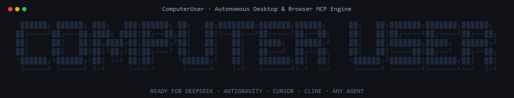

# ComputerUser (Free Computer User)

<p align="center">
  
</p>

<p align="center">
  <strong>Motor autónomo independiente de Computer Use (Windows UI Automation) y Control de Navegador (Chrome & Brave) para cualquier agente de IA.</strong>
</p>

<p align="center">
  
  
  
  
  
</p>

---

## ⚡ Instalación Rápida (1 Solo Comando)

En una terminal de **PowerShell** (como usuario normal), ejecuta:

```powershell
irm https://raw.githubusercontent.com/VictorTrab/computerUser/main/scripts/install.ps1 | iex
```

> **¿Ya clonaste el repositorio?** Puedes instalarlo localmente ejecutando:
> ```powershell
> .\scripts\install.ps1
> ```

### ¿Qué hace el instalador automáticamente?
- 📁 Configura el motor de forma autocontenida sin requerir software de terceros.
- 🌐 Registra el **Native Messaging Host** en Windows para **Google Chrome**, **Brave** y **Microsoft Edge**.
- 🧠 Despliega las **Skills Globales** (`free-computer-user` y `free-control-chrome`) en `~/.agents/skills` y `~/.dsh/skills`.
- 🤖 Configura automáticamente el cliente MCP en **DeepSeek Harness** (`cordis.patch.yml`) y en **Antigravity** (`mcp_config.json`).
- 🛠️ Añade la CLI global `free-computer-user` al **PATH de Windows**.
- 🩺 Ejecuta el chequeo de salud `doctor` al finalizar para garantizar que todo esté operativo.

---

## 🩺 Herramienta CLI de Administración (`free-computer-user`)

Una vez instalado, tienes disponible el comando `free-computer-user` en cualquier ventana de PowerShell o CMD:

### 1. Diagnóstico del sistema (`doctor`)
```powershell
free-computer-user doctor
```
*Verifica runtimes, claves del registro de Windows, extensión de navegador, servidor MCP y lista de aplicaciones autorizadas.*

### 2. Actualizar a la última versión (`update`)
```powershell
free-computer-user update
```
*Descarga las mejoras de GitHub, refresca las skills y sincroniza los navegadores automáticamente.*

### 3. Desinstalar limpiamente (`uninstall`)
```powershell
free-computer-user uninstall
```
*Elimina los registros del Native Messaging Host en Windows, quita las skills y retira la configuración MCP de tus agentes.*

---

## 🧭 Cargar la Extensión en Chrome o Brave

1. Abre `chrome://extensions` o `brave://extensions`.
2. Activa el **«Modo Desarrollador»** (interruptor arriba a la derecha).
3. Haz clic en **«Cargar descomprimida»** y selecciona la carpeta:
   ```text
   C:\Users\<TuUsuario>\.agents\computerUser\extension
   ```
   *(o la carpeta `extension/` dentro de donde clonaste el repo)*.
4. En la tarjeta de **ComputerUser Browser Bridge**, entra en **Detalles** y activa **«Permitir acceso a URLs de archivo»**.

---

## 🚀 Cómo Usarlo con tus Agentes

Una vez instalado, **no necesitas prefijos especiales**. Pídele a tu modelo lo que necesitas en lenguaje natural:

### 🖥️ Automatización de Escritorio (`free-computer-user`)
- *"Lista las ventanas abiertas y dime el título de la activa."*
- *"Abre la calculadora de Windows y suma 45 + 12."*
- *"Captura el estado de la ventana de pruebas de mi software y haz clic en Iniciar Sesión."*

### 🌐 Navegación e Inspección Web (`free-control-chrome`)
- *"Revisa las pestañas que tengo abiertas en Chrome."*
- *"Navega a file:///C:/proyectos/manual.html y valida la estructura de títulos."*
- *"Lee el contenido del artículo de la pestaña activa y genera un resumen."*

---

## 🏗️ Arquitectura del Sistema

```text
computerUser/
├── assets/
│   └── intro.gif                  # Animación de presentación
├── bin/
│   ├── free-computer-user.cmd     # Wrapper ejecutable para consola CMD
│   └── free-computer-user.ps1     # CLI nativo de administración para PowerShell
├── runtime/
│   ├── bin/                       # Servidor MCP Stdio (node_repl.exe) y runtime Node
│   ├── browser/                   # Scripts de automatización web parchados para file://
│   └── extension-host/            # Host nativo de mensajería para navegadores
├── extension/                     # Extensión Manifest V3 para Chrome, Brave y Edge
│   ├── manifest.json              # Manifiesto limpio
│   └── images/                    # Iconos optimizados
├── home/
│   └── computer-use/config.toml   # Whitelist local de aplicaciones autorizadas
├── skills/
│   ├── free-computer-user/        # Guía técnica en inglés para el motor de escritorio
│   └── free-control-chrome/       # Guía técnica en inglés para navegación web
├── rules/
│   └── AGENTS.md                  # Políticas y directivas de seguridad para los agentes
├── scripts/
│   ├── install.ps1                # Instalador universal desatendido (7 pasos)
│   ├── update.ps1                 # Actualizador automático vía Git
│   ├── uninstall.ps1              # Desinstalador limpio
│   └── doctor.ps1                 # Verificador de diagnóstico y salud
└── adapters/
    └── universal_runner.py        # Runner universal CLI (Ollama, DeepSeek, OpenAI, etc.)
```

---

## 🛡️ Seguridad y Aislamiento

- **Control de Acceso:** La lista blanca en `home/computer-use/config.toml` restringe a qué ejecutables puede enviar eventos el motor.
- **Sin Conexiones Externas:** El Native Messaging Host corre en tu máquina (`127.0.0.1 / Stdio`). No envía telemetría ni interactúa con servidores de terceros.
- **Tus Sesiones Reales:** Permite que tus agentes interactúen con tus pestañas abiertas sin obligarte a relanzar Chrome con puertos de depuración expuestos.
